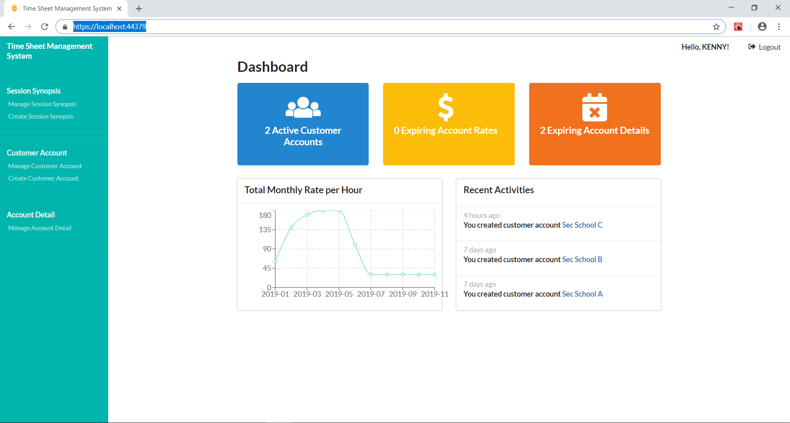
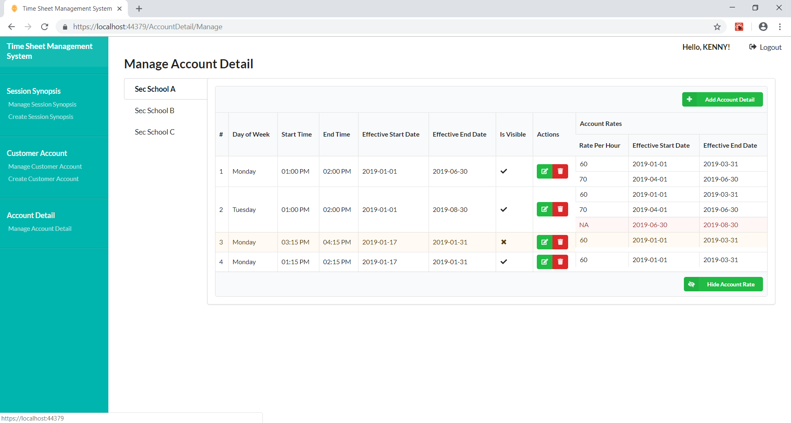

# Time Sheet Management System

Yes, that WEBA assignment _(:3 」∠)_


### Tech Stack

Hardcoded with

Frontend: ReactJS

Backend: ASP.NET Core

Database: SQL

_HEY I TRIED TO USE STORED PROCEDURE_


### How to run this

```
Visual Studio
IIS Express
```
anyhow click and it'll work


### Installing


```
1. FIND YOUR FAVOURITE DIRECTORY

2. git clone https://github.com/Clairetard/TimeSheetManagementSystem

3. Execute DB.sql in SQL?

4. Change some connection strings (i did not do it the right way so change the one at application db context)
```

### Running


Run in Visual Studio


```
Admin - 

Username: 88882 password 123qwe!@#QWE

Instructor - 

Username: 88883 password 123qwe!@#QWE
```


### Project Features

If you're lazy to install, here's how it looks like


there's a dashboard


i got do my work



more tables


### Authors

* **Ducky Escobar** - Project Lead
* **Clair** - Intern


### License

I have driving license


### Disclaimer

The assignment is not perfect. Many assummptions were made. But please give me A

